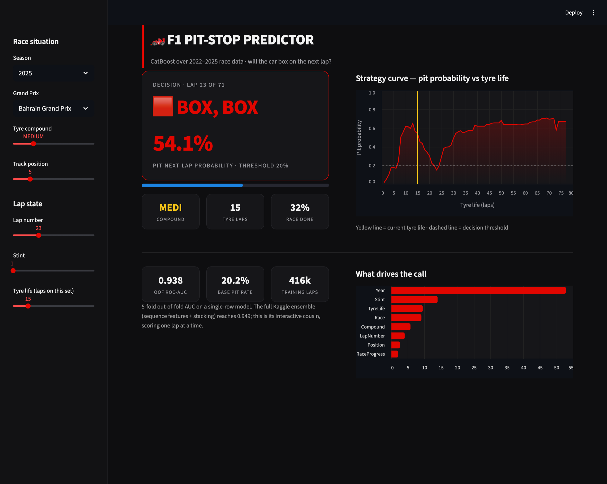

# F1 Pit-Stop Predictor

Link: https://f1-pit-stop-predictor-pdvwisqnemfckq4xfjsxap.streamlit.app/

Vibecoded streamlit app that predicts whether an F1 car pits on the next lap. Set the
track, tyre compound and current lap state; it returns the pit probability, a
BOX / STAY OUT call, and a curve of how that probability moves as the tyres age.



## Model

CatBoost classifier trained on 2022-2025 race data from Kaggle
[Playground Series S6E5](https://www.kaggle.com/competitions/playground-series-s6e5).
It scores one lap at a time.

| | |
|---|---|
| Target | `PitNextLap` (pit on the next lap?) |
| Features | Race, Compound, Year, LapNumber, Stint, TyreLife, Position, RaceProgress |
| 5-fold OOF ROC-AUC | 0.938 |
| Base pit rate | 20.2% |
| Decision threshold | 0.195 (Youden's J on OOF predictions) |

No class weighting, so the predicted probabilities track the real ~20% pit rate
rather than collapsing toward 50%. This keeps the strategy curve readable.

The numbers are lower than a full competition stack (~0.949), which uses lag and
lead features across a whole race. Those need the entire stint history, so they
can't score a single lap on their own. This model gives that up for per-lap
inference.

## Run

```bash
pip install -r requirements.txt
streamlit run app.py
```

Serves at http://localhost:8501.

## Deploy

On [share.streamlit.io](https://share.streamlit.io), point a new app at this
repo with `app.py` as the entrypoint. `model.cbm` and `meta.json` are committed,
so there is no build step.

## Layout

```
app.py            dashboard
model.cbm         trained model
meta.json         dropdowns, race lengths, AUC, threshold
requirements.txt  serving deps
train/            retraining (dataset not included)
assets/           screenshot
```

## Retraining

See [`train/README.md`](train/README.md). Only needed to reproduce or update the
committed model.
